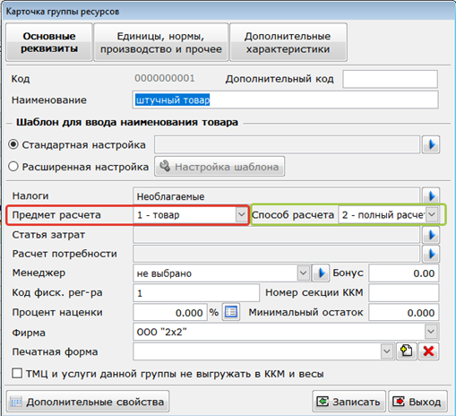
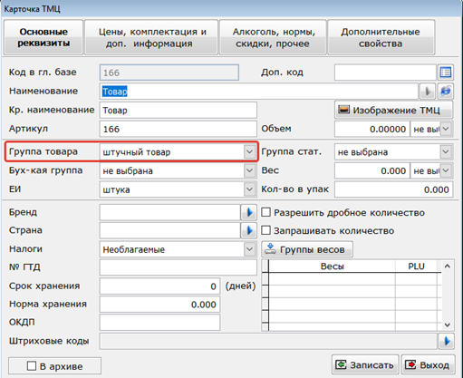

Для выполнения данного требования потребуется создать необходимое количество групп ресурсов (Справочники – Классификаторы – Группы ресурсов) и указать в карточке групп ресурсов необходимые признаки предмета расчета и способа расчета.

[notice="tip"]
Пример заполнения карточек групп ресурсов представлен на следующих рисунках:
[/notice]

[center]

*обычный товар*

*подакцизный товар*
[/center]

В карточке ТМЦ в поле «Группа товара» необходимо выбрать группу ресурсов, с заполненными признаками предмета и способа расчета.

                   

*упрощенная карточка товара                                                                                                      обычная карточка товара*
