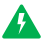

Информация, выделенная данным знаком, является важной и требует обязательного прочтения и/или выполнения

Информация, отмеченная данной иконкой, носит ознакомительный и/или рекомендательный характер.

Информация, отмеченная данной иконкой, является примером использования настройки или механизма работы.

