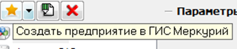
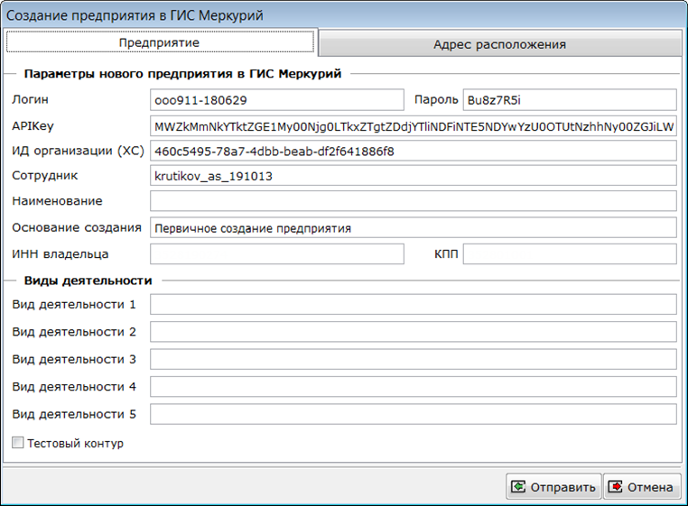
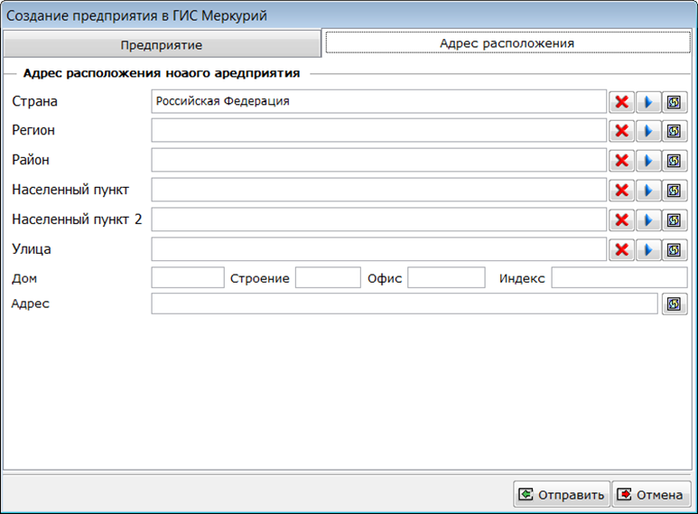

В модуле Меркурий предусмотрена возможность создания в ГИС Меркурий нового предприятия. Это связано с тем, что web интерфейс ГИС не содержит необходимого функционала и клиентам приходится заполнять рукописные формы и передавать их в региональные отделения. Это долгий процесс. В тоже время, API системы позволяет создать предприятие самостоятельно и очень быстро. 

Для создания нового предприятия в окне параметров модуля Меркурий предусмотрена кнопка **Создать предприятие в ГИС Меркурий.**

[center]
 
[/center]

При нажатии этой кнопки будет открыто окна с параметрами нового предприятия.

[center]

[/center]

На закладке **Предприятие** необходимо заполнить параметры доступа к API ГИС Меркурий, название нового предприятия, ИНН и КПП владельца. Так же, необходимо указать хотя бы один вид деятельности нового предприятия. 

[notice="note"]
*Если параметры доступа к* *API* *были заполнены ранее, то они будут перенесены в эту форму.*
[/notice]

На закладке **Адрес местоположения** необходимо указать адрес нового предприятия.

[center]

[/center]

Поля **Страна, Регион, Район, Населенный пункт, Населенный пункт 2, Улица** должны быть выбраны из справочника соответствующих объектов ГИС Меркурий. 

Для загрузки этих справочников предусмотрены кнопки  правее полей ввода. В случае, если элемент не будет выбран из справочника, то ГИС Меркурий может вернуть отказ в регистрации предприятия.

[figure]
Для загрузки этих справочников предусмотрены кнопки   правее полей ввода. 
[/figure]

После заполнения частей адреса необходимо нажать кнопку  правее поля **Адрес**, для генерации адреса единой строкой.

После заполнения всех необходимых полей необходимо нажать кнопку **Отправить**.

При этом в ГИС Меркурий будет отправлен запрос на проверку наличия предприятия с указанным названием. Если такое будет найдено, то перед созданием будет предложено ознакомиться со списком и повторно подтвердить необходимость создания предприятия.

[notice="warning"]
*Запрос может занять некоторое время, обычно, не превышающее одной минуты.*
[/notice]

[center]

[/center]

Если в списке нет создаваемого предприятия, то нажмите кнопку **Создать предприятие**. Предприятие будет создано в ГИС Меркурий.

После создания предприятия в параметрах модуля необходимо обновить список предприятий, нажав кнопку  правее поля ввода **Предприятие**.
