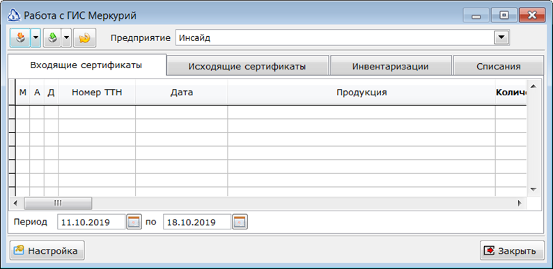
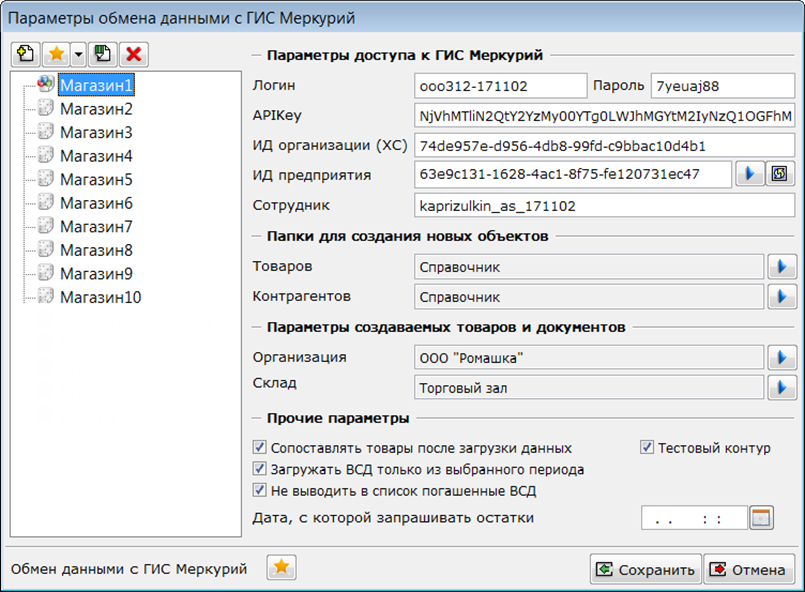
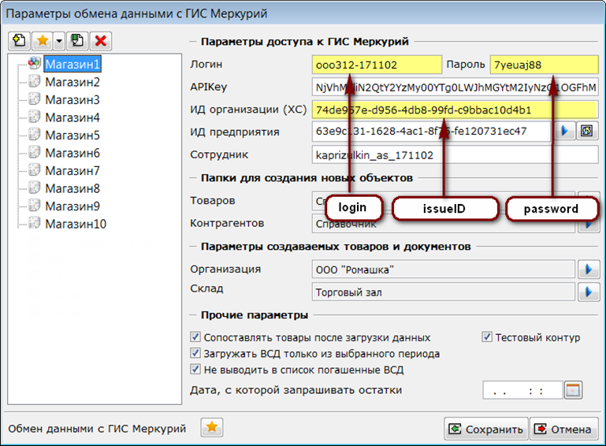

[justify]
Для подключения модуля Меркурий необходимо добавить в систему меню программы пункт *Модуль Меркурий* (название пункта может быть изменено партнёром по его усмотрению). В дистрибутивной базе данный пункт расположен в меню Сервис. Для самостоятельного подключения этого пункта необходимо использовать команду *DO FORM mercuryform*.
[/justify]

[center]

[/center]

Для отображения добавленного пункта в меню необходимо перезапустить систему Айтида. Так же, можно добавить пункт меню для вызова формы сопоставления товаров с продукцией ГИС Меркурий. Для этого необходимо использовать команду *DO* *FORM* *mercurysubst*.

[center]

[/center]

Для пункта меню, вызывающего форму сопоставления контрагентов с партнерами ГИС Меркурий, необходимо использовать команду *DO* *FORM* *mercurysubstpartners*.

Первый запуск модуля необходимо произвести от имени пользователя с правами администратора. В этом случае будет доступен функционал по настройке модуля:

[center]

[/center]

Настройка модуля производится для каждой торговой точки, на которых предполагается обмен данными с ГИС Меркурий. В окне настройки можно указать следующие параметры:

[center]

[/center]

1.  Раздел **Загрузка данных из ГИС Меркурий** заполняется автоматически при установке обновления системы Айтида и содержит текст обработки, выполняющей необходимые функции по взаимодействию с ГИС Меркурий. Раздел доступен при запуске системы в режиме конфигурации при наличии NFR лицензии/сублицензии.
2.  Кнопки **Добавить предприятие в список, Изменить название предприятия в списке** и **Удалить предприятие** **из списка** позволяют формировать список предприятий, подчиненных хозяйствующим субъектам, возможно различным, для работы.
3.  Кнопка **Создать предприятие в ГИС Меркурий** позволяет создать новую площадку, используя API Меркурий. *Подробнее см. в разделе* [*Создание предприятия в ГИС Меркурий*](/docs/mercury/podklyuchenie-i-nastroika-modulya-merkurii/sozdanie-predpriyatiya-v-gis-merkurii)*.*
4.  Поля **Логин, пароль,** **APIKey** **ИД организации (ХС).** В этих полях необходимо указать параметры, полученные от регулятора после регистрации в Ветис.API.

[center]

[/center]

1.   В поле **ИД Предприятия** необходимо указать ИД ранее зарегистрированного предприятия. Значение можно выбрать из списка. Список можно обновить из ГИС Меркурий нажав кнопку **Запросить список из ГИС Меркурий**, расположенную правее поля ввода.
2.   В поле **Сотрудник** необходимо указать логин пользователя, зарегистрированного для доступа к ГИС Меркурий через WEB интерфейс.
3.   В разделе **Папки для создания новых объектов** необходимо выбрать папки справочников, в которых будут создаваться новые товары и контрагенты. Данные, загружаемые из ГИС Меркурий содержат в себе не только электронные сертификаты, но и реквизиты производителей, поставщиков товаров, а также названия самих товаров. При загрузке неопознанные контрагенты и товары будут созданы в указанных папках. При создании новых карточек товара будет учитываться, какая группа ресурсов указана в выбранной папке. В новые карточки будет перенесена информация, заданная в группе ресурсов, так. как если бы эта группа была выбрана в карточке товара интерактивным путем.
