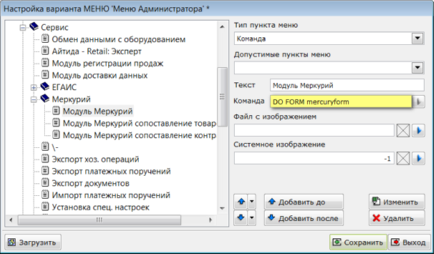

Для подключения модуля Меркурий необходимо добавить в систему меню программы пункт *Модуль Меркурий* (название пункта может быть изменено партнёром по его усмотрению). В дистрибутивной базе данный пункт расположен в меню Сервис. Для самостоятельного подключения этого пункта необходимо использовать команду *DO FORM mercuryform*.

[center]

[/center]

Для отображения добавленного пункта в меню необходимо перезапустить систему Айтида. Так же, можно добавить пункт меню для вызова формы сопоставления товаров с продукцией ГИС Меркурий. Для этого необходимо использовать команду *DO FORM mercurysubst*.
