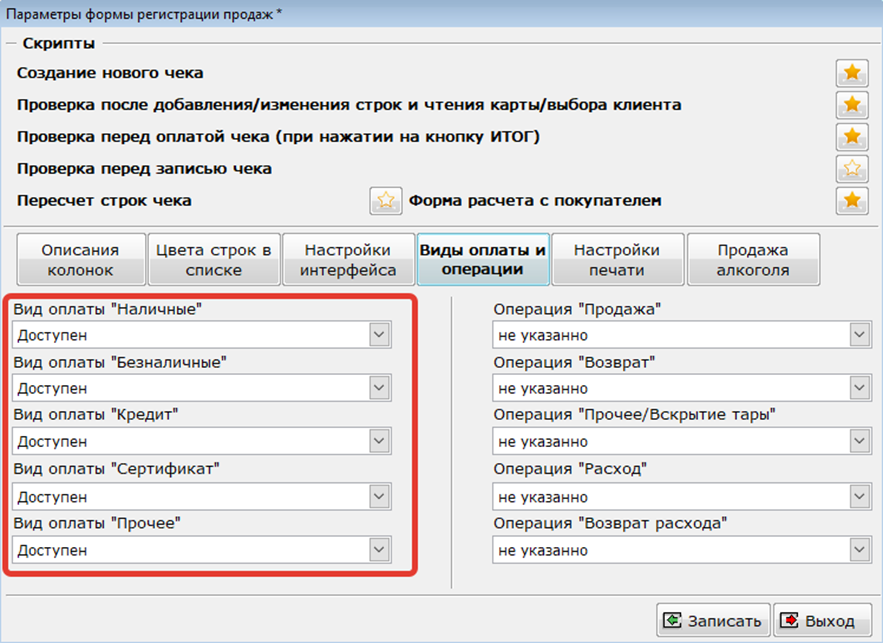
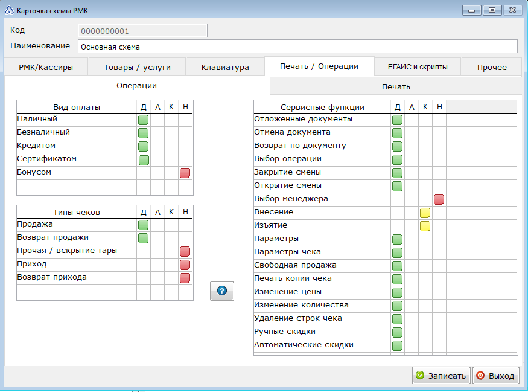

Для работы в Модуле регистрации продаж в соответствии с ФФД 1.05 необходимо выполнить требования следующих пунктов данной инструкции:

*   [Обновление программы Айтида](/54fz/predvaritelnaya-nastroika-programmy-aitida/obnovlenie-programmy-aitida-i-bazy-dannykh)
*   [Обновление профилей оборудования](/54fz/predvaritelnaya-nastroika-programmy-aitida/obnovlenie-profilei-oborudovaniya-dlya-fr)
*   [Установка признаков и способа предмета расчета для товаров](/54fz/predvaritelnaya-nastroika-programmy-aitida/ustanovka-priznakov-predmeta-rascheta-i-sposoba-rascheta-dlya-tovarov)
*   [Настройка соответствия налогов](/54fz/predvaritelnaya-nastroika-programmy-aitida/nastroika-sootvetstviya-nalogov-v-programme-aitida-s-kodami-nalogov-v-kkm)
*   [Заполнение данных по кассирам](/54fz/predvaritelnaya-nastroika-programmy-aitida/zapolnenie-dannykh-po-kassiram)

Подробнее ознакомиться с информацией о включении МРП и работе в нём можно в [руководстве пользователя на стр. 30-34](http://itida.ru/download/docs/2.99/itida_user_29940.pdf), а также в руководстве [администратора на стр. 377-383](http://itida.ru/download/docs/2.99/itida_admin_29940.pdf).

После проведения описанных выше предварительных настроек необходимо настроить доступность видов оплат в МРП. Для этого необходимо перейти в настройки МРП (меню Сервис -Настройка системы – Настройка формы регистрации продаж). В открывшемся окне «Параметры формы регистрации продаж» на закладке «Виды оплаты и операции» необходимо указать, какие виды оплат будут доступны в окне оплат.

[center]

[/center]

Если работа ведется через модуль РМК, то аналогичные настройки необходимо произвести в схеме РМК

[center]

[/center]
